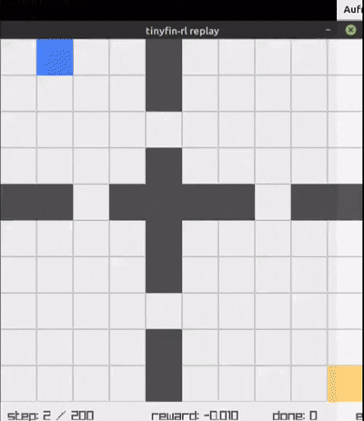

# tinyfin-rl

<p align="center">
  
</p>



Tinyfin-RL is a **C-first reinforcement learning system** with a single
executable, a deterministic environment core, and Tinyfin for tensors +
autograd. Rendering is optional and never drives simulation.

## What’s In Here

- `src/` single-binary implementation (`tinyfin-rl`)
- `tinyfin/` tensor + autograd backend
- `raylib-src/` optional viewer dependency
- `build/libtfrl_env.so` shared env library for Python bindings
- `architecture.md` and `roadmap.md` for direction

## Build

Headless build (no raylib):

```bash
make
./build/tinyfin-rl train --algo dqn --steps 1000
```

With raylib viewer:

```bash
make USE_RAYLIB=1
./build/tinyfin-rl train --algo dqn --steps 1000 --render live --render-fps 10
```

Select environment:

```bash
./build/tinyfin-rl train --algo dqn --env maze_rooms --steps 1000
./build/tinyfin-rl train --algo dqn --env lineworld --steps 500
./build/tinyfin-rl train --algo dqn --env lineworld_duo --steps 500
./build/tinyfin-rl train --algo dqn --env coin_maze_duo --steps 500 --share-policy
./build/tinyfin-rl train --algo dqn --env lineworld_cont --steps 500
./build/tinyfin-rl train --algo random --env point1d --steps 500
./build/tinyfin-rl train --algo dqn --env coin_maze --steps 500
./build/tinyfin-rl train --algo dqn --env lineworld --envs 16 --steps 2000
./build/tinyfin-rl train --algo dqn --env lineworld --envs 8 --threads 4 --render live --render-env 0
```

## Algorithms

```bash
./build/tinyfin-rl train --algo dqn --steps 2000
./build/tinyfin-rl train --algo rainbow --steps 2000
./build/tinyfin-rl train --algo qrdqn --steps 2000
./build/tinyfin-rl train --algo iqn --steps 2000
./build/tinyfin-rl train --algo reinforce --steps 2000 --steps-per-batch 512
./build/tinyfin-rl train --algo ppo --steps 2000 --steps-per-batch 64 --epochs 2 --clip-eps 0.2 --gae-lambda 0.95 --entropy-coef 0.01 --kl-target 0.01
./build/tinyfin-rl train --algo a2c --steps 2000 --steps-per-batch 64
./build/tinyfin-rl train --algo a3c --steps 2000 --envs 4 --steps-per-batch 64
./build/tinyfin-rl train --algo trpo --steps 2000 --steps-per-batch 64 --clip-eps 0.01
./build/tinyfin-rl train --algo sac --steps 2000 --entropy-coef 0.2
./build/tinyfin-rl train --algo td3 --steps 2000
./build/tinyfin-rl train --algo impala --steps 2000 --steps-per-batch 64
./build/tinyfin-rl train --algo impala --steps 2000 --actor-count 4 --queue-capacity 1024
./build/tinyfin-rl train --algo mcts --env maze_rooms --steps 2000 --mcts-sims 400 --mcts-depth 80
./build/tinyfin-rl train --algo dqn --steps 2000 --save runs/dqn
./build/tinyfin-rl eval --algo dqn --episodes 5 --load runs/dqn
```

## Modes

Train:

```bash
./build/tinyfin-rl train --algo dqn --steps 2000 --trace-out runs/run.tft
```

Eval:

```bash
./build/tinyfin-rl eval --algo dqn --episodes 10 --render live
```

Replay:

```bash
make -C raylib-src/src
make clean
make USE_RAYLIB=1
export LD_LIBRARY_PATH="$PWD/raylib-src/src:$PWD/tinyfin:$LD_LIBRARY_PATH"
./build/tinyfin-rl replay --trace-in runs/run.tft --render-fps 10
```

## Notes

- The canonical environment is a four-room grid (`maze_rooms`).
- Reference environments: `lineworld`, `lineworld_cont`, `point1d`, `coin_maze`.
- Multi-agent environments: `lineworld_duo`, `coin_maze_duo`.
- DQN/REINFORCE/PPO plus A2C/A3C/TRPO/IMPALA/Rainbow/QR-DQN/IQN/SAC/TD3 are implemented in C using Tinyfin.
- Rendering is optional and uses render snapshots, not env-owned raylib.

## Python Env Bridge (Sockets)

The Python bridge lets the C runner drive Gymnasium/PettingZoo/Retro via a UNIX
socket server.

```bash
python3 python/bridge_server.py --socket /tmp/tfrl_py_bridge.sock
export TFRL_PY_BRIDGE=/tmp/tfrl_py_bridge.sock
./build/tinyfin-rl train --algo dqn --env py:gymnasium:CartPole-v1 --steps 2000
```

## Docs

- `docs/overview.md` quickstart and modes
- `docs/algorithms.md` DQN/REINFORCE/PPO usage
- `docs/render_snapshot.md` snapshot format
- `docs/trace.md` trace format
- `docs/perf.md` batch stepping + benchmark
- `docs/cli.md` CLI reference
- `docs/training.md` training recipes
- `docs/replay.md` trace replay
- `docs/determinism.md` determinism contract + flags
- `docs/install.md` build notes
- `docs/python_bridge.md` Python env bridge (Gymnasium/PettingZoo/Retro)
- `docs/python_workflow.md` Python usage overview (C loop + bridge)
- `docs/env_api.md` env API + Python binding
- `scripts/run_tests.sh` lightweight test runner
- `scripts/golden_runs.sh` golden run regression script
- `scripts/ci.sh` build + tests + golden runs
- `scripts/bridge_smoke.sh` optional Gymnasium bridge smoke test
- `python/README.md` optional Python wrapper
- `architecture.md` system design
- `roadmap.md` milestones
